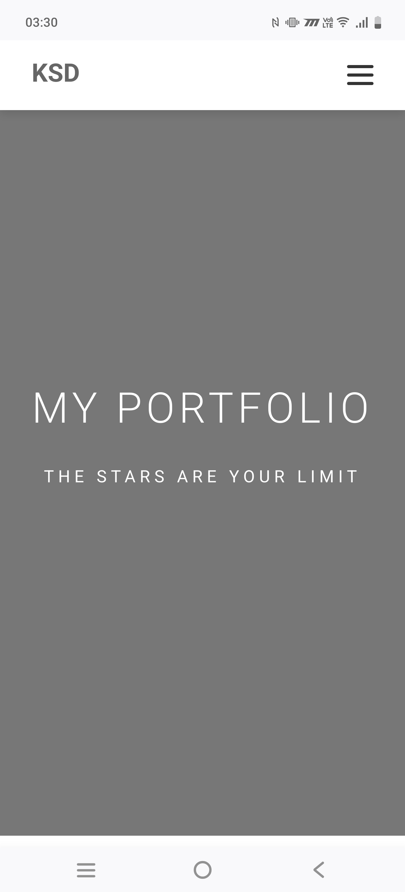
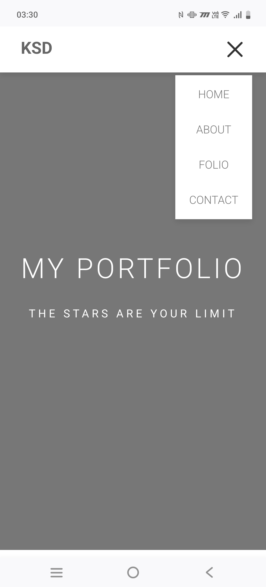
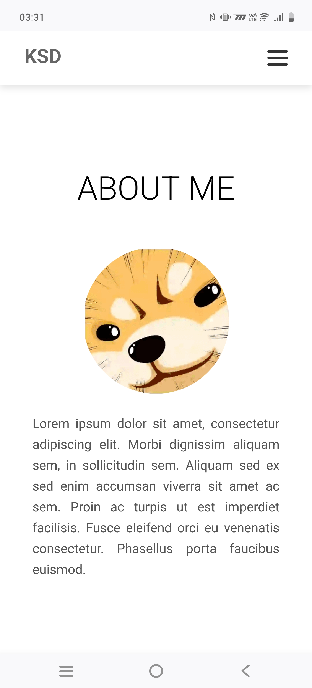
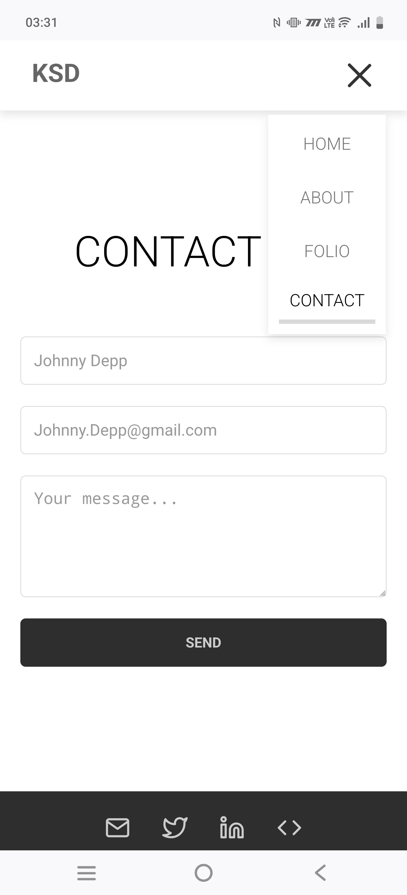

# Portfolio (Assignment Day 2-4)
Day 2 – HTML &amp; Structure 
Day 3 - CSS Implementation

# Preview
### Day 2 Result:

### Day 3 Result:

#### Desktop:

#### Mobile: 
Home Page

Dropdown Menu

About Me Page

Contact Me Page

# Live Demo
Live link here:
[GitHub Page Demo](https://kennethdjasmin.github.io/Task-2-Practice-Exercise/index.html)

