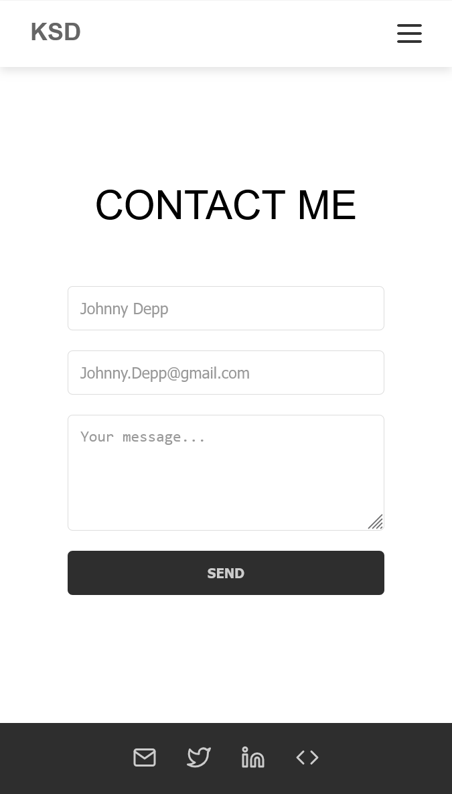

## Portfolio (Assignment Day 2-4)
Day 2 – HTML &amp; Structure 
Day 3 - CSS Implementation 
Day 4 - JS Addons

## Live Demo
Live link here:
[GitHub Page Demo](https://kennethdjasmin.github.io/Task-2-Practice-Exercise/index.html)

## Preview
**Day 2 Result:**

**Day 3 Result:**

* Desktop:

* Mobile:

**Day 4 Result:**

* Desktop:
  - Home Page

  - About Me Page

  - Previous Work Page

  - Contact Me Page

* Mobile:
  - Home Page

  - About Me Page

  - Previous Work Page

  - Contact Me Page

